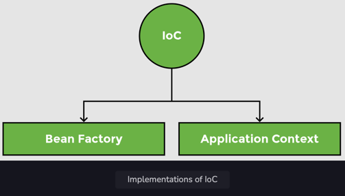
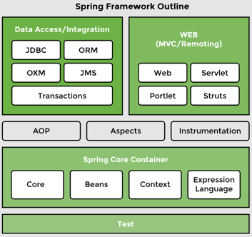
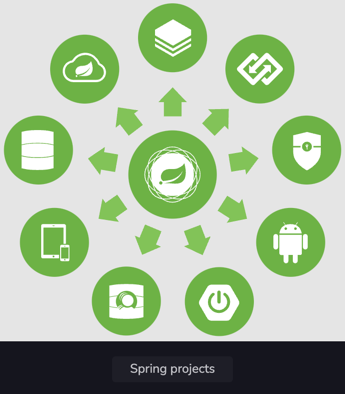

<details>
<summary>Terminology</summary>

Learn the different terms used in the world of Spring.

The following topics are covered:
- Beans
- Autowiring
- Dependency injection
- Inversion of Control
- IoC container
- Bean factory
- Application context

### Beans

Beans are the objects of classes that are managed by Spring. Traditionally, objects used to create their own dependencies, but Spring manages all the dependencies of an object and instantiates the object after injecting the required dependencies. The `@Component` annotation is the most common method of defining beans.

```java
@Component
public class Vehicle {

}
```

### Autowiring

The process of identifying a dependency, looking for a match, and then populating the dependency is called autowiring. The `@Autowired` annotation tells Spring to find and inject a collaborating bean into another. If more than one bean of the same type is available, Spring throws an error. In the following scenario, two beans of type `Operator` are detected by Spring:

```java
@Component
class Arithmetic(){
    @Autowired
    private Operator operator;
    //...
}

@Component
class Addition implements Operator {

}

@Component
class Subtraction implements Operator {

}
```

Spring will not know which bean to inject in the `Arithmetic` bean unless the developer explicitly specifies it.

### Dependency injection

Dependency injection is the process by which Spring looks up the beans that are needed for a particular bean to function and injects them as a dependency. Spring can perform dependency injection by using a **constructor** or by using a **setter method**.

### Inversion of Control

Traditionally, the class which needed the dependency created an instance of the dependency. The class decided when to create the dependency and how to create it. For example, `Engine` class is a dependency of `Vehicle` class, which creates its object:

```java
class Vehicle {
  
    private Engine engine = new Engine();
    //...
}
```

Spring takes this responsibility from the class and creates the object itself. The developer simply mentions the dependency and the framework takes care of the rest.

```java
class Vehicle {
 
    private Engine engine;
    //...
}
```

Thus, control moves from the component that needs the dependency to the framework. The framework takes the responsibility for finding out the dependencies of a component, ensuring their availability and injecting them in the component. This process is called **Inversion of Control**.


### IoC container

An **IoC container** is a framework that provides the **Inversion of Control** functionality.

The IoC container manages the beans. For the above-mentioned example, it creates an instance of the `Engine` class, then creates an instance of `Vehicle` class, and then injects the `Engine` object as a dependency into the `Vehicle` object.

```java
class Vehicle {
    private Engine engine;
    //...   
}
```

**IoC container** is a generic term. It is not framework-specific. Spring offers two implementations of the **IoC container**:
1. Bean factory
2. Application context



Both of them are interfaces that have different implementations available. Application context is the typical IoC container in the context of Spring. Spring recommends using it unless there is a memory concern, like in a mobile device. If available memory is low, bean factory should be used.

### Bean factory

The basic version of the Spring IoC container is **bean factory**. It is the legacy IoC container and provides basic management for beans and wiring of dependencies. In Spring, bean factory still exists to provide backward compatibility.

### Application context

**Application context** adds more features to the bean factory that are typically needed by an enterprise application. It is the most important part of the Spring framework. All the core logic of Spring happens here. It includes basic management of beans and wiring of dependencies as provided by the bean factory. Additional features in application context include **Spring AOP** features, **internationalization**, **web application context**, etc.

</details>


<details>
<summary>Spring Architecture</summary>

Discussion of the modular architecture of Spring and popular Spring projects.

The following topics are covered:
- Spring modules
  - Data access / integration
  - Web (MVC / remoting)
  - Test
  - AOP
- Spring projects

Spring is not one big framework. It is broken down into modules. This can be seen in the Maven Dependencies folder, where there are a lot of JAR files instead of just one big JAR.


Spring is built in a modular way and this enables some modules to be used without using the whole framework. It also makes integration with other frameworks easy. The developer can choose which module to use and discard ones that are not required.

### Spring modules

The modules of Spring architecture, grouped together in layers, are shown below:



The Core Container contains the following modules: **Beans**, **Core**, **Context**, and **Spring Expression Language (SpEL)**. These modules provide fundamental functionality of the Spring framework, like **Inversion of Control (IoC)**, **dependency injection**, **internationalization** as well as support for querying the object at run time.

### Data access / integration

Spring has very good integration with data and integration layers, and provides support to interact with databases. It contains modules like **JDBC**, **ORM**, **OXM**, **JMS**, and **Transactions**.
- The JDBC (Java Database Connectivity) module allows the data layer to interact with databases to get data or store data, or to interact with other systems without the need of cumbersome JDBC coding. Spring JDBC is very straightforward as compared to plain JDBC and makes the code very short.
- The ORM (Object Relational Mapping) module provides support to integrate with ORM frameworks including Hibernate and JPA.
- The JMS (Java Messaging Service) module talks to other applications through the queue to produce and consume messages.
- The OXM (object-XML mapping) module makes the object-to-XML transformation easy by providing useful features.
- The transaction management module provides support for successful rollback in case a transaction fails.

### Web (MVC / remoting)

It contains the **Web**, **Servlets**, **Portlets**, and **Sockets** modules to support the creation of a web application. Spring offers a web framework of its own called **Spring MVC**.

### Test

The **Test** module handles the cross-cutting concern of unit testing. The **Spring Test** framework supports testing with **JUnit**, **TestNG**, as well as creating mock objects for testing the code in isolation.

### AOP

The **AOP** module provides **Aspect Oriented Programming** functionality like **method interception** and **pointcuts** as well as **security** and **logging** features. Spring has its own module called **Spring AOP** that offers basic, aspect-oriented programming functionality. Advanced AOP functionality can be implemented through integration with **AspectJ**. AOP features cross-cutting concerns from business logic.

### Spring projects

Spring also provides solutions to different enterprise application problems through **Spring projects**. Some of them are discussed below:



**Spring Boot** is used to develop microservices. It makes developing applications easy through features like startup projects, auto configuration, and actuator. Spring Boot has gained massive popularity since it was first released in 2014.

**Spring Cloud** allows the development of cloud native applications that can be dynamically configured and deployed. It provides functionality for handling common patterns in distributed systems.

**Spring Data** provides consistent access to SQL and NoSQL databases.

**Spring Integration** implements the patterns outlined by the book Enterprise Application Integration Patterns. It allows enterprise applications to be connected easily through messaging and declarative adapters.

**Spring Batch** provides functionality to handle large volumes of data like ability to restart, ability to read from and write to different systems, chunk processing, parallel processing, and transaction management.

**Spring Security** provides security solutions for different applications be it a web application or a REST service. It also provides authentication and authorization features.

**Spring Session** manages session information and makes it easier to share session data between services in the cloud regardless of the platform/container. It also supports multiple sessions in a single browser instance.

**Spring Mobile** offers device detection and progressive rendering options that make mobile web application development easy.

**Spring Android** facilitates the development of Android applications.

</details>


<details>
<summary>Reasons for Sustained Popularity</summary>


</details>