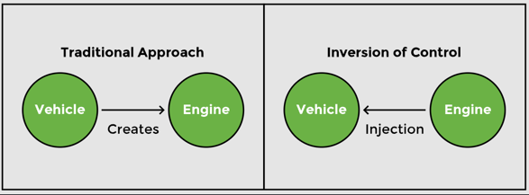
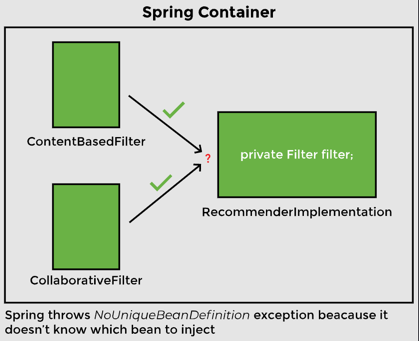

<details>
<summary>Terminology</summary>

Learn the different terms used in the world of Spring.

The following topics are covered:
- Beans
- Autowiring
- Dependency injection
- Inversion of Control
- IoC container
- Bean factory
- Application context

### Beans

Beans are the objects of classes that are managed by Spring. Traditionally, objects used to create their own dependencies, but Spring manages all the dependencies of an object and instantiates the object after injecting the required dependencies. The `@Component` annotation is the most common method of defining beans.

```java
@Component
public class Vehicle {

}
```

### Autowiring

The process of identifying a dependency, looking for a match, and then populating the dependency is called autowiring. The `@Autowired` annotation tells Spring to find and inject a collaborating bean into another. If more than one bean of the same type is available, Spring throws an error. In the following scenario, two beans of type `Operator` are detected by Spring:

```java
@Component
class Arithmetic() {
    @Autowired
    private Operator operator;
    //...
}

@Component
class Addition implements Operator {

}

@Component
class Subtraction implements Operator {

}
```

Spring will not know which bean to inject in the `Arithmetic` bean unless the developer explicitly specifies it.

### Dependency injection

Dependency injection is the process by which Spring looks up the beans that are needed for a particular bean to function and injects them as a dependency. Spring can perform dependency injection by using a **constructor** or by using a **setter method**.

### Inversion of Control

Traditionally, the class which needed the dependency created an instance of the dependency. The class decided when to create the dependency and how to create it. For example, `Engine` class is a dependency of `Vehicle` class, which creates its object:

```java
class Vehicle {
    private Engine engine = new Engine();
    //...
}
```

Spring takes this responsibility from the class and creates the object itself. The developer simply mentions the dependency and the framework takes care of the rest.

```java
class Vehicle {
    private Engine engine;
    //...
}
```

Thus, control moves from the component that needs the dependency to the framework. The framework takes the responsibility for finding out the dependencies of a component, ensuring their availability and injecting them in the component. This process is called **Inversion of Control**.



### IoC container

An **IoC container** is a framework that provides the **Inversion of Control** functionality.

The IoC container manages the beans. For the above-mentioned example, it creates an instance of the `Engine` class, then creates an instance of `Vehicle` class, and then injects the `Engine` object as a dependency into the `Vehicle` object.

```java
class Vehicle {
    private Engine engine;
    //...   
}
```

**IoC container** is a generic term. It is not framework-specific. Spring offers two implementations of the **IoC container**:
1. Bean factory
2. Application context


Both of them are interfaces that have different implementations available. Application context is the typical IoC container in the context of Spring. Spring recommends using it unless there is a memory concern, like in a mobile device. If available memory is low, bean factory should be used.

### Bean factory

The basic version of the Spring IoC container is **bean factory**. It is the legacy IoC container and provides basic management for beans and wiring of dependencies. In Spring, bean factory still exists to provide backward compatibility.

### Application context

**Application context** adds more features to the bean factory that are typically needed by an enterprise application. It is the most important part of the Spring framework. All the core logic of Spring happens here. It includes basic management of beans and wiring of dependencies as provided by the bean factory. Additional features in application context include **Spring AOP** features, **internationalization**, **web application context**, etc.

</details>


<details>
<summary>Spring Architecture</summary>

Discussion of the modular architecture of Spring and popular Spring projects.

The following topics are covered:
- Spring modules
  - Data access / integration
  - Web (MVC / remoting)
  - Test
  - AOP
- Spring projects

Spring is not one big framework. It is broken down into modules. This can be seen in the Maven Dependencies folder, where there are a lot of JAR files instead of just one big JAR.


Spring is built in a modular way and this enables some modules to be used without using the whole framework. It also makes integration with other frameworks easy. The developer can choose which module to use and discard ones that are not required.

### Spring modules

The modules of Spring architecture, grouped together in layers, are shown below:


The Core Container contains the following modules: **Beans**, **Core**, **Context**, and **Spring Expression Language (SpEL)**. These modules provide fundamental functionality of the Spring framework, like **Inversion of Control (IoC)**, **dependency injection**, **internationalization** as well as support for querying the object at run time.

### Data access / integration

Spring has very good integration with data and integration layers, and provides support to interact with databases. It contains modules like **JDBC**, **ORM**, **OXM**, **JMS**, and **Transactions**.
- The JDBC (Java Database Connectivity) module allows the data layer to interact with databases to get data or store data, or to interact with other systems without the need of cumbersome JDBC coding. Spring JDBC is very straightforward as compared to plain JDBC and makes the code very short.
- The ORM (Object Relational Mapping) module provides support to integrate with ORM frameworks including Hibernate and JPA.
- The JMS (Java Messaging Service) module talks to other applications through the queue to produce and consume messages.
- The OXM (object-XML mapping) module makes the object-to-XML transformation easy by providing useful features.
- The transaction management module provides support for successful rollback in case a transaction fails.

### Web (MVC / remoting)

It contains the **Web**, **Servlets**, **Portlets**, and **Sockets** modules to support the creation of a web application. Spring offers a web framework of its own called **Spring MVC**.

### Test

The **Test** module handles the cross-cutting concern of unit testing. The **Spring Test** framework supports testing with **JUnit**, **TestNG**, as well as creating mock objects for testing the code in isolation.

### AOP

The **AOP** module provides **Aspect Oriented Programming** functionality like **method interception** and **pointcuts** as well as **security** and **logging** features. Spring has its own module called **Spring AOP** that offers basic, aspect-oriented programming functionality. Advanced AOP functionality can be implemented through integration with **AspectJ**. AOP features cross-cutting concerns from business logic.

### Spring projects

Spring also provides solutions to different enterprise application problems through **Spring projects**. Some of them are discussed below:


**Spring Boot** is used to develop microservices. It makes developing applications easy through features like startup projects, auto configuration, and actuator. Spring Boot has gained massive popularity since it was first released in 2014.

**Spring Cloud** allows the development of cloud native applications that can be dynamically configured and deployed. It provides functionality for handling common patterns in distributed systems.

**Spring Data** provides consistent access to SQL and NoSQL databases.

**Spring Integration** implements the patterns outlined by the book Enterprise Application Integration Patterns. It allows enterprise applications to be connected easily through messaging and declarative adapters.

**Spring Batch** provides functionality to handle large volumes of data like ability to restart, ability to read from and write to different systems, chunk processing, parallel processing, and transaction management.

**Spring Security** provides security solutions for different applications be it a web application or a REST service. It also provides authentication and authorization features.

**Spring Session** manages session information and makes it easier to share session data between services in the cloud regardless of the platform/container. It also supports multiple sessions in a single browser instance.

**Spring Mobile** offers device detection and progressive rendering options that make mobile web application development easy.

**Spring Android** facilitates the development of Android applications.

</details>


<details>
<summary>Reasons for Sustained Popularity</summary>

Discussion of some factors of Spring that led to its widespread adoption and sustained popularity.

The following topics are covered:
- Flexibility and integration with other frameworks
- Removes plumbing code
- Promotes testable code
- Staying up-to-date

### Flexibility and integration with other frameworks

Spring has a very flexible architecture. Spring modules are not dependent on one another and offer a developer the freedom to pick and choose according to the requirements of the application. Spring projects are designed with very specific purposes in mind.

Spring offers integration with a large number of frameworks. For example, even though Spring offers its own MVC framework, SpringMVC, it also offers integration with other MVC frameworks. Using Spring does not decrease the developer's options.

### Removes plumbing code

Plumbing code not only makes programming longer but also reduces the readability of code. For example, in JDBC programming, a lot of code is required for simple functionality. Connection establishment and exception handling span many lines of code.

Spring removes plumbing code and lets the programmer focus on the application logic. The amount of code written in Spring is negligible. No exception handling code is required because Spring makes all its exceptions unchecked.

### Promotes testable code

Spring framework enables writing testable code. It offers good integration with JUnit and Mockito frameworks, which lets us write unit tests quickly and easily. The core feature of Spring is dependency injection and if it is used properly, writing unit tests for the code becomes very easy.

### Staying up-to-date

Spring is able to stay current and adapt to changes in development. For example, microservices and cloud services have evolved in the last decade. Spring has come up with projects to keep up with the trend, like Spring Boot, which helps with designing microservices.

</details>


<details>
<summary>Creating a project</summary>

There are different ways of creating a Spring project:
1. Follow the **Spring Initializr** instructions: https://start.spring.io/
   - Select the dependencies and create a basic project structure with a **Maven** or **Gradle** build specification. This project is available for download in the form of a zip file to be used in a variety of IDEs like **Eclipse**, **IntelliJ**, etc.
2. Use the **Spring Initializr** plugin for IntelliJ.
3. If using **Maven** for dependency management and you know the dependencies your project will need: <a href="https://search.maven.org/">Search **Maven Central**</a> for the dependencies your project requires. 
4. Refer to the `pom.xml` of this project and copy any dependencies your project requires.

The highlight of Spring Boot is its auto-configuration feature whereby it automatically includes all the dependencies of a project based on property files and JAR classpaths. Spring Boot is basically the Spring framework along with embedded servers. Spring Boot removes the need for XML configuration.


<blockquote>Note: Given the simplicity and ease that Spring Boot provides, we will use it to create our first Spring project.</blockquote>

This project will use a **Maven** build configuration, with **Spring Boot v2.4.3** at the time of this writing.

Any version which is greater than **Spring Boot 2.0** should work for the examples in this project. It is better to avoid `SNAPSHOT` versions as they are alpha or beta versions.

Specify a **GroupId** and **ArtifactId** for the project. This project used the IntelliJ IDE's **New Project** prompts to create these.


Spring Initializr, by default, creates Spring as one of the dependencies of the project, so we do not need to explicitly specify any dependency. Later in this course, we will create projects with dependencies like **Web**, **AOP**, **JDBC**, **JPA**, etc.


When the **Generate** button on the form is clicked, the Initializer creates a zip file that is downloaded by the browser. Unzip this file and place it in a folder on the hard drive.

To import this project in Eclipse, choose **File => Import => Existing Maven Projects**. Search for **Maven** in the search bar if the option isn't visible. Browse to the folder on the hard drive where the unzipped Spring Boot project is placed. The `pom.xml` file can be seen. Select the file and click **Finish** to import the project.


All the dependencies needed to set up the project will be downloaded via the IDE. When the import process finishes, the following hierarchy can be seen:
- `src/main/java` where the Java code will be written. Right now, it contains the project file `<YourAppName>Application.java`
- `src/main/resources` where the application properties are written.
- `src/test/java` where the tests will be written.


The `pom.xml` file contains the project metadata information and lists the dependencies.

If using **Eclipse**, The Maven Dependencies folder contains the jar files of all the dependencies. If you used Initializr, Spring may have automatically added the dependencies `spring-boot-starter`, `spring-context`, `spring-beans`, and `spring-core`, among other dependencies.


When the project dependencies are finished downloading, they can be found in the **External Libraries** folder, if using **IntelliJ**.

The `org.squidmin.spring` package contains the main application, `Application.java`, which contains the `main` method. The `main` method of the `Application` class can be used to execute the Spring Boot application.

In IntelliJ, an easy way to run the main application is to right-click on the `Application.java` file in the **Project View** and select **Run 'Application.main()'**.


This will launch a simple *Spring context*. The program successfully runs and prints some text on the console.


</details>


<details>
<summary>Section 1: Dependency</summary>

This section discusses the concept of dependency by setting up a simple example using a Spring Boot application.

The following topics are covered:
- Tight coupling

In this section, we will build a movie recommender system and add some logic to it.

A recommender system is a system that filters some entities based on the user's history. Recommender systems also rank these items based on user preferences. The system works by taking an input and then finding items similar to that input.

In this section, we will write the basic code for a movie recommender application. The application will take a movie and recommend other movies similar to it. There are various ways in which recommendations can be found. One method is content-based filtering in which item-to-item similarity is used as a basis for finding matches. So, for a movie like Finding Dory, the system will find movies of the same genre, like Happy Feet, Ice Age, Shark Tale, etc.


1. We will create sub-packages inside the `org.squidmin.spring.basics.movierecommendersystem` package to keep the files for every section separate. This is an optional step. Right-click on the base package, mouse-hover **New =>**, and select **Package**. Then provide the name as `section1` and press **Enter** to create the sub-package.


The package for each section contains the `MovieRecommenderSystemApplication` class containing the main method. This file can simply be copied from the `org.squidmin.spring.basics.movierecommendersystem` package to the newly created package.


2. We will create a class named `RecommenderImplementation` in the section1 sub-package.


The `RecommenderImplementation` class will have a method called `recommendMovies()`, which will find similar movies using a content-based filter and then return the results.

The `recommendMovies()` method takes a movie as input so the input parameter is of type String and returns a list of similar movies. Hence, the return type is String[]. Inside the method, we will use a filter to find similar movies and return the results.

```java
public class RecommenderImplementation {
    public String[] recommendMovies (String movie) {
        return new String[] {"M1", "M2", "M3"};
    }
}
```

We need to hard code the results returned by this method to avoid compile-time errors. The hard coded results will be removed in **step 5**.

Now, we will write the logic of the `recommendMovies()` method in the `RecommenderImplementation` class. As mentioned earlier, we will use a technique called content-based filtering to find movie recommendations. We can implement this technique as a separate class to keep the `recommendMovies()` method independent of the filter implementation.

We will create a new class `ContentBasedFilter` that has a method `getRecommendations()` implementing the logic of the content-based filter. The method returns a list of movies that are relevant to the input, taking into account the user's watch history as well as movies that are similar to the input. We will not make it complex at this step and ignore input arguments like the number of movies to recommend, user's watch history, and the user-movie matrix of ratings.

Our method will have just one input parameter, the movie name, of `String` type. All the steps in finding the relevant movies are performed in this method.

<blockquote>We have hardcoded the results. The <code>getRecommendations()</code> method returns three movies similar to the movie, “<i>Finding Dory</i>”.</blockquote>

```java
public class ContentBasedFilter {
    public String[] getRecommendations(String movie) {
        // TODO: Logic of content based filter
        return new String[] {"Happy Feet", "Ice Age", "Shark Tale"};
    }
}
```

Now, we can use an object of the `ContentBasedFilter` class in the `RecommenderImplementation` class as follows:

Since the `getRecommendations()` method is returning a `String[]`, we can remove our hard-coded results and replace them with the actual ones returned by the method.

In the `MovieRecommenderSystemApplication` class, we will create an object of the `RecommenderImplementation` class and use it to find movie recommendations for the movie, *Finding Dory*, as follows:

```java
import java.util.Arrays;

public class MovieRecommenderSystemApplication {
    public static void main(String[] args) {
        RecommenderImplementation recommender = new RecommenderImplementation();    
        String[] result = recommender.recommendMovies("Finding Dory");
        System.out.println(Arrays.toString(result));
    }
}
```

To make the output readable, we use the `toString()` method after importing `java.util.Arrays`.

The code in the widget below, when executed, returns a list of movies hard-coded in the `ContentBasedFilter` class.

### `MovieRecommenderSystem.java`

```java
package org.squidmin.spring.basics.movierecommendersystem.section1;

import java.util.Arrays;

import org.springframework.boot.autoconfigure.SpringBootApplication;
import org.squidmin.spring.basics.movierecommendersystem.section1.RecommenderImplementation;


@SpringBootApplication
public class MovieRecommenderSystemApplication {

    public static void main(String[] args) {

        //SpringApplication.run(MovieRecommenderSystemApplication.class, args);

        // Create an instance of the RecommenderImplementation class.
        RecommenderImplementation recommender = new RecommenderImplementation();

        // Call the recommendMovies() method to get recommendations.
        String[] result = recommender.recommendMovies("Finding Dory");

        // Display the results.
        System.out.println(Arrays.toString(result));

    }

}
```

### `RecommenderImplementation.java`

```java
package org.squidmin.spring.basics.movierecommendersystem.section1;

import org.squidmin.spring.basics.movierecommendersystem.section1.ContentBasedFilter;

public class RecommenderImplementation {

    public String[] recommendMovies(String movie) {
        // Use content based filter to find similar movies.

        ContentBasedFilter filter = new ContentBasedFilter();
        String[] results = filter.getRecommendations(movie);

        // Return the results.
        //return new String[] {"M1", "M2", "M3"};
        return results;
    }

}
```

### `ContentBasedFilter.java`

```java
package org.squidmin.spring.basics.movierecommendersystem.section1;

public class ContentBasedFilter {
	public String[] getRecommendations(String movie) {
		// Implement logic of content based filter.
		
		// Return movie recommendations.
		return new String[] {"Happy Feet", "Ice Age", "Shark Tale"};
	}
}
```

#### Output

```
[Happy Feet, Ice Age, Shark Tale]
```

### Tight coupling

As can be seen, the `ContentBasedFilter` class is a dependency of the `RecommenderImplementation` class. The `RecommenderImplementation` class needs an object of the `ContentBasedFilter` class to perform its task. This is an example of tight coupling.


If we want to use another filter in place of the content-based filter, we will need to change the code in the `RecommenderImplementation` class.

Consider a scenario where we want to use one type of filter in one situation and another type of filter in another situation. Tight coupling makes this difficult to achieve.

In the simple example above, we created two classes which work together, thus creating a dependency. In a typical enterprise application, there are a large number of objects which work together to provide some end result to the user. This results in a lot of dependencies. Spring is a dependency injection framework that makes the process of managing these dependencies easy.

</details>


<details>
<summary>Section 2: Decoupling Components</summary>

Discussion of changing tightly coupled code to be loosely coupled.

The following topics are covered:
- Filter interface
- Loose coupling

Right now, the `RecommenderImplementation` class is hard coded to use the `ContentBasedFilter` class. If we need to change the way our application recommends movies, we will need to change the code of the `RecommenderImplementation` class.

Say we want to switch from the `ContentBased` filter to `Collaborative` filter and take into account the preferences of users having a similar watch history.

<figure>

<figcaption align="center"><b>Collaborative filtering</b></figcaption>
</figure>

1. We've created a subpackage called **section2** inside the `org.squidmin.spring.basics.movierecommendersystem` package for the code example shown in this lesson.<br/><br/>The package contains the `MovieRecommenderSystemApplication.java`, `RecommenderImplementation.java`, and `ContentBasedFilter.java` files from the previous lesson.
   <br/><br/>
2. Changing the type of filter from **content based** to **collaborative** would call for a change in the code of the `RecommenderImplementation` class.<br/><br/>First, let's create a class `CollaborativeFilter`, which, like the `ContentBasedFilter` class, has one method `getRecommendations()` as follows:

```java
public class CollaborativeFilter {
    public String[] getRecommendations(String movie) {
        // TODO: Logic of collaborative filter
        return new String[] { };
     }
 }
```

This method recommends a list of movies for “*Finding Dory*” based on the logic of the `CollaborativeFilter` class.

3. If we want to switch to the new filter created in the previous step, we will have to change the code in the `RecommenderImplementation` class as follows:

```java
public class RecommenderImplementation {
    public String[] recommendMovies(String movie) {
        CollaborativeFilter filter = new CollaborativeFilter();
        String[] results = filter.getRecommendations("Finding Dory");
        return results;
    }
}
```

Here, we have created an object of the `CollaborativeFilter` class instead of the `ContentBasedFilter` class. Every time we want to change the filter implementation, we will have to change the code in the `recommendMovies()` method.

### Filter interface

One way to make the code loosely coupled is by using an interface called `Filter`. An interface contains abstract methods whose implementation is left to the classes using it.

The `Filter` interface will have only one method definition.

```java
public interface Filter {
    public String[] getRecommendations(String movie);
}
```

Both `ContentBasedFilter` and `CollaborativeFilter` now implement the `Filter` interface.

```java
public class ContentBasedFilter implements Filter {
    //...
}
```

```java
public class CollaborativeFilter implements Filter {
    //...
}
```

### Loose coupling

Loose coupling can be achieved by making the `RecommenderImplementation` class use the interface instead of one of its implementations. We will create a constructor for the `RecommenderImplementation` class to initialize the `Filter`.

```java
public class RecommenderImplementation {

    // Use the Filter interface to select the filter.
    private Filter filter;
            
    public RecommenderImplementation(Filter filter) {
        super();
        this.filter = filter;
    }

    // Use a filter to find recommendations.
    public String [] recommendMovies (String movie) {
        //...
    }
    
}
```

The method `getRecommendations()` now belongs to the interface. To check which implementation of the interface is being used to get movie recommendations, we can print the name of the filter as follows:

```java
public class RecommenderImplementation {
    // Use the Filter interface to select the filter.
    private Filter filter;

    public RecommenderImplementation(Filter filter) {
        super();
        this.filter = filter;
    }
    
    public String[] recommendMovies(String movie) {
        // Print the name of interface implementation being used.
        System.out.println("Name of the filter in use: " + filter + "\n");

        String[] results = filter.getRecommendations("Finding Dory");

        return results;
    }
}
```

By using the interface instead of an actual implementation, we can dynamically choose which algorithm to use. Our code has now become loosely coupled. In the `MovieRecommenderSystemApplication` file, when we create a `RecommenderImplementation` object, we can pass the name of the filter to use:

#### `MovieRecommenderSystem.java`

```java
package org.squidmin.spring.basics.movierecommendersystem.section2;

import java.util.Arrays;

import org.springframework.boot.autoconfigure.SpringBootApplication;
import org.squidmin.spring.basics.movierecommendersystem.section2.ContentBasedFilter;
import org.squidmin.spring.basics.movierecommendersystem.section2.RecommenderImplementation;

@SpringBootApplication
public class MovieRecommenderSystemApplication {

    public static void main(String[] args) {
        // Passing the name of the filter as a constructor argument.
        RecommenderImplementation recommender = new RecommenderImplementation(new ContentBasedFilter());

        // Call recommendMovies() method to get recommendations.
        String[] result = recommender.recommendMovies("Finding Dory");

        // Display results.
        System.out.println(Arrays.toString(result));
    }

}
```

#### `CollaborativeFilter.java`

```java
package org.squidmin.spring.basics.movierecommendersystem.section2;

import org.squidmin.spring.basics.movierecommendersystem.section2.Filter;

public class CollaborativeFilter implements Filter {
    public String[] getRecommendations(String movie) {
        // TODO: Logic of content based filter
        return new String[]{"Finding Nemo", "Ice Age", "Toy Story"};
    }
}
```

#### `ContentBasedFilter.java`

```java
package org.squidmin.spring.basics.movierecommendersystem.section2;

import org.squidmin.spring.basics.movierecommendersystem.section2.Filter;

public class ContentBasedFilter implements Filter {

    public String[] getRecommendations(String movie) {
        // TODO: Implement the logic of the content based filter.

        // Return movie recommendations.
        return new String[]{"Happy Feet", "Ice Age", "Shark Tale"};
    }

}
```

#### `RecommenderImplementation.java`

```java
package org.squidmin.spring.basics.movierecommendersystem.section2;

import org.squidmin.spring.basics.movierecommendersystem.section2.Filter;

public class RecommenderImplementation {

    // Use the Filter interface to select filter.
    private Filter filter;

    public RecommenderImplementation(Filter filter) {
        super();
        this.filter = filter;
    }

    // Use a filter to find recommendations.
    public String[] recommendMovies(String movie) {
        // Print the name of the interface implementation being used.
        System.out.println("Name of the filter in use: " + filter + "\n");

        String[] results = filter.getRecommendations("Finding Dory");

        return results;
    }

}
```

#### `Filter.java`

```java
package org.squidmin.spring.basics.movierecommendersystem.section2;

public interface Filter {
	public String[] getRecommendations(String movie);
}
```

Let's now change the code to use the `CollaborativeFilter` and see the output change.

In this section we made the `RecommenderImplementation` class independent of the filter implementation. The `RecommenderImplementation` now calls methods of the `Filter` interface.


Now `Filter` is a dependency of `RecommenderImplementation`. We still have to create an object of `RecommenderImplementation` and an object of `Filter` and pass the objects to the constructor.

</details>


<details>
<summary>Section 3: Managing Beans and Dependencies</summary>

Learn how to use annotations to direct Spring to manage beans and autowire dependencies.

The following topics are covered:
- `@Component`
- `@Autowired`
- `@ComponentScan`
- `@SpringBootApplication`

So far, we have created objects of the `RecommenderImplementation` class and two classes implementing the `Filter` interface.
We are binding the objects together in the constructor.
Our code is now loosely coupled as we are passing the name of the filter to be used as a constructor argument.

Spring automates the above process of creating objects and binding them together.
It takes the responsibility of creating instances of classes and binding instances based on their dependencies.
The instances or objects that Spring manages are called beans.
To manage objects and dependencies, Spring requires information about three things:
- Beans
- Dependencies
- Location of beans

1. For the code example shown in this section, we have created a sub-package called `section3` inside the package `org.squidmin.spring.basics.movierecommendersystem`.

   The package contains the following files from the previous section:
   - `MovieRecommenderSystemApplication.java`
   - `RecommenderImplementation.java`
   - `ContentBasedFilter.java`
   - `CollaborativeFilter.java`

### `@Component`
- If we want Spring to create and manage objects, we can do so by adding the `@Component` annotation at the beginning of the class and importing `org.springframework.stereotype.Component`.
  For now, we want Spring to manage objects of the `RecommenderImplementation` and `ContentBasedFilter` classes only, so we will add the `@Component` annotation at two places in the code:

```java
import org.springframework.stereotype.Component;

@Component
public class RecommenderImplementation {
    // ...
}
```

```java
import org.springframework.stereotype.Component;

@Component
public class ContentBasedFilter implements Filter {
    // ...
}
```

The Spring container will have two beans, one of type `RecommenderImplementation` and the other of type `ContentBasedFilter`.


### `@Autowired`

- The second thing Spring needs to know is the dependencies of each object.
  The `@Autowired` annotation is used for this purpose, and we need to import `org.springframework.beans.factory.annotation.Autowired` to be able to use this annotation.
  In our application, the `ContentBasedFilter` class (which implements the `Filter` interface) is a dependency of the `RecommenderImplementation` class.

```java
import org.springframework.stereotype.Component;
import org.springframework.beans.factory.annotation.Autowired;

@Component
public class RecommenderImplementation {
    @Autowired
    private Filter filter;
    // ...
}
```

The `@Autowired` annotation tells Spring that `RecommenderImplementation` needs an object of type `Filter`. In other words, `Filter` is a dependency of `RecommenderImplementation`.


- The third thing that Spring requires from the developer, is the location of the beans so that it can find them and autowire the dependencies. The `@ComponentScan` annotation is used for this purpose. This annotation can be used with or without arguments. It tells Spring to scan a specific package and all of its sub-packages. In our case, all the files that contain beans are in the same package, `org.squidmin.spring`, so we want Spring to do a component scan on this package. Since we are using Spring Boot, it uses the `@SpringBootApplication` annotation on the `MovieRecommenderSystemApplication` class. This annotation is equivalent to the following three annotations:
- `@Configuration`, which declares a class as the source for bean definitions
- `@EnableAutoConfiguration`, which allows the application to add beans using classpath definitions
- `@ComponentScan`, which directs Spring to search for components in the path specified


Because of the `@SpringBootApplication` annotation, we do not need to use `@ComponentScan` annotation in our code.

### `@SpringBootApplication`

`@SpringBootApplication` tells Spring to scan all the files in the package where the class with this annotation is present. It also scans any sub-packages of the package where it is placed.

When we use the `@Component`, `@Autowired`, and `@SpringBootApplication` annotations, the following line in our code becomes redundant as it is automatically done by Spring:

`RecommenderImplementation recommender = new RecommenderImplementation(new ContentBasedFilter());`

The beans that Spring creates are managed by the **Application Context**. We can get information about a bean from the **Application Context**. The run method returns the `ApplicationContext`, which can be assigned to a variable `appContext`. Then the `getBean()` method of `ApplicationContext` can be used to get the bean of a particular class. We will create a local variable `recommender` and assign the bean to it as follows:

```java
public class MovieRecommenderSystemApplication {
    public static void main(String[] args) {
        // ApplicationContext manages the beans and dependencies.
        ApplicationContext appContext = SpringApplication.run(MovieRecommenderSystemApplication.class, args);

        // Use ApplicationContext to find which filter is being used.
        RecommenderImplementation recommender = appContext.getBean(RecommenderImplementation.class);

        // Call method to get recommendations.
        String[] result = recommender.recommendMovies("Finding Dory");

        // Display results. 
        System.out.println(Arrays.toString(result));
    }
}
```

Instead of us having to create an instance of the `RecommenderImplementation` class, **Spring Application Context** creates the beans.
We can simply pick it up from there and use it to execute the `recommendMovies` method.

This might look complex to a beginner, but consider for a moment an application that has hundreds of beans, each having a number of dependencies. The fact that we do not have to explicitly create beans and manually wire in the dependencies makes the job of a developer very easy.

When we run this application (see the `MovieRecommenderSystemApplication.java` class in the `section3` subdirectory), the output shows that the bean being used is `ContentBasedFilter`. If the `@Component` annotation is used on the `CollaborativeFilter` class instead of the `ContentBasedFilter` class, the output will change accordingly.

To understand what goes on in the background, you may change the logging level to `debug`.
This can be done by adding the following to the `application.properties` file in `src/main/resources`:

```yml
Logging.level.org.springframework = debug
```

**Logback** has been used for logging in this project.

THe `spring-boot-starter-logging` dependency included with Spring Boot should contain all the dependencies for Logback to work properly.
Refer to the `logback-spring.xml` file in this project, located at: `/src/main/resources`.

For more info about Logback usage, you can refer to the following resource, among many others freely available on the web:
- <a href="https://springframework.guru/using-logback-spring-boot/">Baeldung: Using Logback with Spring Boot</a>

After adding the above config to `application.yml`, the terminal will display logs of all the actions that are being performed in the background. A summary of the actions is reproduced below:

- `Loading source class...`

  The package is being searched. Spring starts with a component scan to find anything with `@Component` as well as other annotations.

- `Identified candidate component class...`

  Spring identifies two candidates which have the `@Component` annotation as we only used it in two places in our code.

- `Creating shared instance of singleton bean 'movieRecommenderSystemApplication'...`

- `Creating shared instance of singleton bean 'contentBasedFilter'`

  Spring starts creating instances of the beans. It creates beans that do not have any dependency first.

- `Creating shared instance of singleton bean 'recommenderImplementation'`

  `Autowiring by type from bean name ‘recommenderImplementation’ via constructor to bean named ‘contentBasedFilter'`

  Now Spring can autowire the dependency using the constructor that we have provided and creates the `RecommenderImplementation` bean.

- To better understand these annotations, play around with the code below and see what error messages Spring throws when some of the annotations are missing. The error message can be found at the end of the log.

  If we remove `@Component` from the `ContentBasedFilter` class, Spring will throw an error when trying to autowire the dependency saying it required a bean of type `Filter` that could not be found.

  If we remove `@Component` from the `RecommenderImplementation` class as well, we will get an error when trying to execute the `getBean()` method as no beans exist.

  If we add `@Component` to the `CollaborativeFilter` class, Spring will not know which bean of `Filter` type to autowire. It says, “expected single matching bean but found two”.

  <br />

  #### `MovieRecommenderSystemApplication.java`

  ```java
  package org.squidmin.spring.basics.movierecommendersystem.section3;
  
  import java.util.Arrays;

  import org.springframework.boot.SpringApplication;
  import org.springframework.boot.autoconfigure.SpringBootApplication;
  import org.springframework.context.ApplicationContext;
  
  @SpringBootApplication
  public class MovieRecommenderSystemApplication {
  
      public static void main(String[] args) {
          
          //ApplicationContext manages the beans and dependencies
          ApplicationContext appContext = SpringApplication.run(MovieRecommenderSystemApplication.class, args);
  
          //use ApplicationContext to find which filter is being used
          RecommenderImplementation recommender = appContext.getBean(RecommenderImplementation.class);	
          
          //call method to get recommendations
          String[] result = recommender.recommendMovies("Finding Dory");
          
          //display results
          System.out.println(Arrays.toString(result));
  
      }
  
  }
  ```

  #### `CollaborativeFilter.java`  

  ```java
  package org.squidmin.spring.basics.movierecommendersystem.section3;
  
  import org.springframework.stereotype.Component;

  @Component
  public class CollaborativeFilter implements Filter {
      public String[] getRecommendations(String movie) {
          // Logic of collaborative filter.
          return new String[] {"Finding Nemo", "Ice Age", "Toy Story"};
      }
  }
  ```
  
  <br />

  #### `ContentBasedFilter.java`

  ```java
  package org.squidmin.spring.basics.movierecommendersystem.section3;
  
  import org.springframework.stereotype.Component;
  
  @Component
  public class ContentBasedFilter implements Filter{
  
      // getRecommendations takes a movie as input and returns a list of similar movies.
      public String[] getRecommendations(String movie) {
          // Implement logic of the content based filter.
          
          // Return the movie recommendations.
          return new String[] {"Happy Feet", "Ice Age", "Shark Tale"};
      }
  
  }
  ```

  <br />  

  #### `Filter.java`

  ```java
  package org.squidmin.spring.basics.movierecommendersystem.section3;
  
  public interface Filter {
      public String[] getRecommendations(String movie);
  }
  ```
  
  <br />

  #### `RecommenderImplementation.java`

  ```java
  package org.squidmin.spring.basics.movierecommendersystem.section3;
    
  import org.springframework.beans.factory.annotation.Autowired;
  import org.springframework.stereotype.Component;
  
  @Component
  public class RecommenderImplementation {
  
      // Filter is a dependency of RecommenderImplementation.
      //@Autowired
      private Filter filter;
              
      public RecommenderImplementation(Filter filter) {
          super();
          this.filter = filter;
      }
  
      // Use a filter to find recommendations.
      public String[] recommendMovies(String movie) {
          // Print the name of interface implementation being used.
          System.out.println("\nName of the filter in use: " + filter + "\n");
          String[] results = filter.getRecommendations("Finding Dory");
          return results;
      }
  
  }
  ```
  
  <br />

  #### `logback-spring.xml`

  ```xml
  <?xml version="1.0" encoding="UTF-8"?>
  <configuration debug="true" scan="true" scanPeriod="10 seconds">
      <include resource="org/springframework/boot/logging/logback/defaults.xml"/>
      <include resource="org/springframework/boot/logging/logback/console-appender.xml" />
      <appender name="CONSOLE" class="ch.qos.logback.core.ConsoleAppender">
          <encoder>
              <pattern>${CONSOLE_LOG_PATTERN}</pattern>
              <charset>utf8</charset>
          </encoder>
      </appender>
      <root level="DEBUG">
          <appender-ref ref="CONSOLE" />
      </root>
      <logger name="org.springframework" level="INFO"/>
  </configuration>
  ```
  
<br />

In this section, `MovieRecommenderSystemApplication.java` also contains methods demonstrating how to manually exit a Spring Boot application via programmatic means.

In the `MovieRecommenderSystemApplication.java` class, in the `section3` package, refer to the following methods:

- `exitApplication`
- `writePID`

These methods instantiate the Spring Boot application in a way that enabled exiting the application programmatically.

</details>


<details>
<summary>Section 4: Autowiring by Type - @Primary</summary>

This section demonstrates how Spring dynamically autowires a dependency in case it finds more than one component of the same type.

The following topics are covered:
- `NoUniqueBeanDefinitionException`
- `@Primary` annotation

In the last section, we saw Spring manage two beans of the `RecommenderImplementation` and `ContentBasedFilter` classes for us.
In this section, we will add another bean and see how Spring can dynamically choose a bean if it finds two matches of the same type.

1. For the code example shown in this lesson, we have created a sub-package called `section4` inside the package `org.squidmin.spring.basics.movierecommendersystem`.

   The package contains 4 classes:
   - `MovieRecommenderSystemApplication.java`
   - `RecommenderImplementation.java`
   - `ContentBasedFilter.java`
   - `CollaborativeFilter.java`

   from the previous section.

### `NoUniqueBeanDefinitionException`

2. We will add the `@Component` annotation on the `CollaborativeFilter` class to declare it a bean.
   Now both implementations of the `Filter` interface are beans.
   Previously, when Spring searched for a dependency to be autowired in the `RecommenderImplementation` object, it only found one bean of matching type.
   Now, when we run the application, it fails to start.

   <br />

   

   The `NoUniqueBeanDefinitionException` occurs. The error message says: `Required a single bean but two were found`.

   <br />

   #### `MovieRecommenderSystemApplication.java`

   ```java
   package org.squidmin.spring.basics.movierecommendersystem.section4;
   
   import java.util.Arrays;
   
   import org.springframework.boot.SpringApplication;
   import org.springframework.boot.autoconfigure.SpringBootApplication;
   import org.springframework.context.ApplicationContext;
   
   @SpringBootApplication
   public class MovieRecommenderSystemApplication {
   
       public static void main(String[] args) {
       
           // ApplicationContext manages the beans and dependencies.
           ApplicationContext appContext = SpringApplication.run(MovieRecommenderSystemApplication.class);
   
           // Use ApplicationContext to find which filter is being used.
           RecommenderImplementation recommender = appContext.getBean(RecommenderImplementation.class);
   
           // Call method to get recommendations.
           String[] result = recommender.recommendMovies("Finding Dory");
   
           // Display results.
           System.out.println(Arrays.toString(result));
   
       }
   
   }
   ```
   
   <br />

   #### `Filter.java`

   ```java
   package org.squidmin.spring.basics.movierecommendersystem.section4;
   
   public interface Filter {
       public String[] getRecommendations(String movie);
   }
   ```
   
   <br />

   #### `CollaborativeFilter.java`

   ```java
   package org.squidmin.spring.basics.movierecommendersystem.section4;
   
   import org.springframework.stereotype.Component;
   
   @Component
   public class CollaborativeFilter implements Filter {
   
       public String[] getRecommendations(String movie) {
           // Logic of collaborative filter.
           return new String[] { "Finding Nemo", "Ice Age", "Toy Story" };
       }
   
   }
   ```
   
   <br />

   #### `RecommenderImplementation.java`

   ```java
   package org.squidmin.spring.basics.movierecommendersystem.section4;
   
   import org.springframework.beans.factory.annotation.Autowired;
   import org.springframework.stereotype.Component;
   
   @Component
   public class RecommenderImplementation {
   
       // Filter is a dependency of RecommenderImplementation.
       @Autowired
       private Filter filter;
   
       public RecommenderImplementation(Filter filter) {
           super();
           this.filter = filter;
       }
   
       // Use a filter to find recommendations.
       public String[] recommendMovies(String movie) {
           // Print the name of interface implementation being used.
           System.out.println("\nName of the filter in use: " + filter + "\n");
           String[] results = filter.getRecommendations("Finding Dory");
           return results;
       }
   
   }
   ```
   
   #### `ContentBasedFilter.java`

   ```java
   package org.squidmin.spring.basics.movierecommendersystem.section4;
   
   import org.springframework.stereotype.Component;
   
   @Component
   public class ContentBasedFilter implements Filter {
   
       // getRecommendations takes a movie as input and returns a list of similar movies.
       public String[] getRecommendations(String movie) {
           // Implement logic of the content based filter.
           
           // Return the movie recommendations.
           return new String[] { "Happy Feet", "Ice Age", "Shark Tale" };
       }
   
   }
   ```

   ### `@Primary` annotation

3. One way Spring can choose between two beans of the same type is by giving one bean priority over the other.
   The `@Primary` annotation is used for making a component the default choice when multiple beans of the same type are found.

   Let's say we want the collaborative filter to take precedence. We will add the `@Primary` annotation on the `CollaborativeFilter` class and import `org.springframework.context.annotation.Primary`.
   When we run the application now, it uses thr `CollaborativeFilter` as expected.

   

   #### `MovieRecommenderSystemApplication.java`

   ```java
   package org.squidmin.spring.basics.movierecommendersystem.section4;
    
   import java.util.Arrays;
    
   import org.springframework.boot.SpringApplication;
   import org.springframework.boot.autoconfigure.SpringBootApplication;
   import org.springframework.context.ApplicationContext;
        
   @SpringBootApplication
   public class MovieRecommenderSystemApplication {

       public static void main(String[] args) {
        
           //ApplicationContext manages the beans and dependencies
           ApplicationContext appContext = SpringApplication.run(MovieRecommenderSystemApplication.class, args);

           //use ApplicationContext to find which filter is being used
           RecommenderImplementation recommender = appContext.getBean(RecommenderImplementation.class);	
        
           //call method to get recommendations
           String[] result = recommender.recommendMovies("Finding Dory");
        
           //display results
           System.out.println(Arrays.toString(result));

       }
        
   }
   ```
   
   <br />

   #### `Filter.java`

    ```java
    package org.squidmin.spring.basics.movierecommendersystem.section4;
    
    public interface Filter {
      public String[] getRecommendations(String movie);
    }
    ```
   
   <br />

   #### `CollaborativeFilter.java`

    ```java
    package org.squidmin.spring.basics.movierecommendersystem.section4;
    
    import org.springframework.stereotype.Component;
    import org.springframework.context.annotation.Primary;
    
    @Component
    @Primary
    public class CollaborativeFilter implements Filter {
        public String[] getRecommendations(String movie) {
            //logic of collaborative filter
            return new String[] {"Finding Nemo", "Ice Age", "Toy Story"};
        }
    }
    ```
   
   <br />

   #### `RecommenderImplementation.java`

    ```java
    package org.squidmin.spring.basics.movierecommendersystem.section4;
   
    import org.springframework.beans.factory.annotation.Autowired;
    import org.springframework.stereotype.Component;
    
    @Component
    public class RecommenderImplementation {
    
        //Filter is a dependency of RecommenderImplementation
        @Autowired
        private Filter filter;
                
        public RecommenderImplementation(Filter filter) {
            super();
            this.filter = filter;
        }
    
        //use a filter to find recommendations
        public String [] recommendMovies (String movie) {
            
            //print the name of interface implementation being used
            System.out.println("\nName of the filter in use: " + filter + "\n");
    
            String[] results = filter.getRecommendations("Finding Dory");
        
            return results;
        }
    
    }
    ```
   
   <br />

   #### `ContentBasedFilter.java`

    ```java
    package org.squidmin.spring.basics.movierecommendersystem.section4;
    
    import org.springframework.stereotype.Component;
    import org.springframework.context.annotation.Primary;
    
    @Component
    //@Primary
    public class ContentBasedFilter implements Filter {
        // getRecommendations takes a movie as input and returns a list of similar movies.
        public String[] getRecommendations(String movie) {
            // Implement logic of the content based filter.
    
            // Return the movie recommendations.
            return new String[] {"Happy Feet", "Ice Age", "Shark Tale"};
        }
    }
    ```
   
   Using `@Primary` is called _autowiring by type_. We are looking for instances of type `Filter`.

4. If we make both beans primary by adding the `@Primary` annotation to both implementations of the `Filter` interface, we will get an error.
   This happens because Spring doesn't know which one to inject in the `RecommenderImplementation` object.
   The error message states: `more than one 'primary' bean found among candidates`.

</details>
